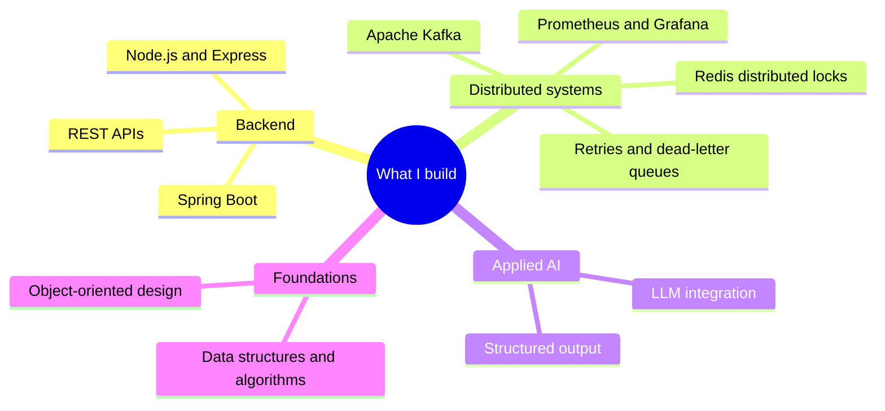

---

### About

I'm a Computer Science master's student at Northeastern University in Silicon Valley, and most of my time goes into backend and distributed systems. The part of engineering I enjoy most is what only shows up under real load: concurrency, handling failure gracefully, and keeping a system observable when things go wrong.

Right now I'm looking for a **software engineering co-op from January to August 2027** (backend or full-stack).

 

---

### What I like to build

---

### Tech I work with

**Languages**

**Backend and Distributed**

**Infrastructure and DevOps**

**Frontend**

---

### Featured projects

| Project | What it is | Built with |
|---|---|---|
| **[Distributed Task Scheduler](https://github.com/PubuduGunasekara/distributed-task-scheduler)** | At-least-once background job scheduling with a Redis distributed lock, exponential-backoff retries, a dead-letter queue, and full observability | Java, Spring Boot, Kafka, Redis |
| **[AI Code Review Assistant](https://github.com/PubuduGunasekara/ai-code-reviewer)** · [live](https://main.d3dm91k4g9mtr9.amplifyapp.com/) | Posts severity-tagged AI reviews on GitHub pull requests | Node.js, React, gpt-4o-mini, Redis |
| **[Travel Day Scheduler](https://github.com/PubuduGunasekara/SmartTravelPlanner)** | Optimizes a full day's itinerary with Weighted A* search | Python, Flask |
| **[Bird Conservatory](https://github.com/PubuduGunasekara/Bird-Conservatory-Management-System)** | A clean OOP domain model with a multi-level class hierarchy and enums | Java |
| **[Role Playing Games](https://github.com/PubuduGunasekara/RolePlayingGames)** | Turn-based battle simulator built around clean design patterns | Java |
| **[Smart Farm](https://github.com/PubuduGunasekara/smart-farm-1.1.0)** | Award-winning IoT farm app (Top 10, NSBM Green EXE) | React Native, Firebase |

---

### Leadership and beyond code

- Led the **Smart Farm IoT project team**, coordinating the hardware, software, and cloud work into one system (selected Top 10 at NSBM Green EXE v1.0)
- **1st place** at the NSBM Green University overnight hackathon
- Led a **QA sub-team at Virtusa** across Sri Lanka, UK, and Australia sprint cycles, and delivered client-facing demos
- **Graduate Leadership Institute (GLI)**, Northeastern University, Silicon Valley
- Completed the **CliftonStrengths** assessment to understand how I work best on a team

---

<b>What I'm focused on right now</b>

 

- Going deep on data structures and algorithms, practicing in C++
- Distributed systems patterns: consistency, fault tolerance, and observability
- Shipping more applied-AI features into real products

<b>Earlier projects, in a nutshell</b>

 

Before the work above, I built a range of full-stack and coursework projects that taught me the fundamentals: a multi-user MERN blog with JWT auth, role-based access, and server-side rendering; a property-management application; freelance WordPress sites; and several hackathon entries. They are where I learned to ship before I focused in on backend and distributed systems.

---

**Open to a software engineering co-op, January to August 2027.**
The fastest way to reach me is [LinkedIn](https://www.linkedin.com/in/pubudugunasekera/) or [email](mailto:pubudupguna@gmail.com).

