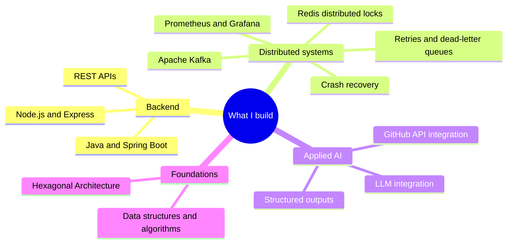

<div align="center">


### pubudugunasekara.github.io — portfolio source

[](https://pubudugunasekara.github.io/)
[](https://github.com/PubuduGunasekara/PubuduGunasekara.github.io/actions)


</div>

---

### What this is

The source for my portfolio site. It's a statically exported Next.js app hosted on GitHub Pages, built to do one job well: show a hiring manager what I build and how I reason about it, in about sixty seconds.

The homepage is deliberately short. The depth lives in two case studies that walk through the engineering decisions behind my flagship projects, including where those systems fall short.

---

### Highlights

- **Two long-form case studies** — [Distributed Task Scheduler](https://pubudugunasekara.github.io/projects/task-scheduler/) and [AI Code Review Assistant](https://pubudugunasekara.github.io/projects/ai-code-reviewer/), each structured as Problem → Architecture → Key decisions → Failure scenarios → Testing → Observability → Deployment → Known limitations.
- **Interactive architecture diagrams** — hand-built SVG, keyboard navigable, click or tab a node to read what it does.
- **Content/presentation split** — all copy lives in `lib/content.ts` and `lib/caseStudies.ts`; components only render.
- **Light and dark themes** with a persisted preference, tuned separately for contrast.
- **Accessibility** — WCAG AA contrast targets, full keyboard navigation, `prefers-reduced-motion` respected throughout.
- **Static export** — no server, no runtime dependencies, deployed straight to GitHub Pages.

---

### Tech stack

| Layer | Choice |
|---|---|
| Framework | Next.js 15 (App Router, `output: 'export'`) |
| Language | TypeScript |
| Styling | Tailwind CSS with CSS-variable design tokens (`ink` / `signal` scales) |
| Motion | Framer Motion, gated behind `prefers-reduced-motion` |
| Type | Space Grotesk + Geist Mono via `next/font` |
| Hosting | GitHub Pages via GitHub Actions |

---

### Project structure

```
app/
  layout.tsx            # metadata, fonts, theme provider, JSON-LD
  page.tsx              # homepage section composition
  opengraph-image.tsx   # generated 1200x630 social card
  sitemap.ts
  projects/[slug]/      # statically generated case-study routes
components/
  Hero.tsx  Nav.tsx  Footer.tsx
  CaseStudyView.tsx     # shared case-study layout
  sections/             # one component per homepage section
    SchedulerDiagram.tsx  ReviewerDiagram.tsx   # interactive SVG diagrams
  ui/                   # Section, EditorialCard, Reveal, ThemeToggle, icons
lib/
  content.ts            # all homepage copy and data
  caseStudies.ts        # case-study content
  theme.tsx             # light/dark tokens and toggle
  hooks.ts              # prefers-reduced-motion and friends
public/assets/          # résumé PDF, logos, profile image
```

---

### Running it locally

```bash
npm ci
npm run dev      # http://localhost:3000
npm run build    # static export to ./out
```

Node 20 or newer, matching CI.

---

### Editing content

Almost every change is a content change, not a code change:

- **Homepage copy and data** — `lib/content.ts` (hero, experience, skills, projects, education, certifications, leadership, journey, contact links)
- **Case studies** — `lib/caseStudies.ts`
- **Résumé PDF** — `public/assets/`

The Contact section's "Book a 15-minute chat" button only renders when `links.calendly` is set, so leaving it empty hides it.

---

### Deployment

Every push to `main` triggers `.github/workflows/deploy.yml`, which builds the static export and publishes it to GitHub Pages. No manual step.

---

### About me

I'm an M.S. Computer Science student at Northeastern University in Silicon Valley (Khoury College), working mostly in backend and distributed systems. The parts of engineering I find most interesting are the ones that only show up under load: concurrency, failure handling, and keeping a system observable when things go wrong.

Before my master's I worked at Virtusa as an Associate Engineer in QA, building Java and Selenium test automation for a British Telecommunications platform serving 1M+ users.

**I'm looking for a Software Engineering internship for Summer 2027.**


```mermaid
mindmap
  root((What I build))
    Backend
      Java and Spring Boot
      REST APIs
      Node.js and Express
    Distributed systems
      Apache Kafka
      Redis distributed locks
      Retries and dead-letter queues
      Crash recovery
      Prometheus and Grafana
    Applied AI
      LLM integration
      Structured outputs
      GitHub API integration
    Foundations
      Data structures and algorithms
      Hexagonal Architecture
```

Selected work:

| Project | What it is | Built with |
|---|---|---|
| [Distributed Task Scheduler](https://github.com/PubuduGunasekara/distributed-task-scheduler) | At-least-once background job execution with a Redis distributed lock, a database state machine, backoff retries, a dead-letter queue, crash recovery, and end-to-end observability | Java 21, Spring Boot, Kafka, Redis, PostgreSQL |
| [AI Code Review Assistant](https://github.com/PubuduGunasekara/ai-code-reviewer) · [live](https://main.d3dm91k4g9mtr9.amplifyapp.com/) | Reviews a GitHub pull request via OAuth and returns severity-tagged findings in a strict JSON schema, with Redis rate limiting and caching | Node.js, Express, React, gpt-4o-mini, Redis, AWS |
| [Travel Day Scheduler](https://github.com/PubuduGunasekara/SmartTravelPlanner) | Weighted / anytime A* itinerary planner with iterative weight escalation and heap pruning (2-person graduate algorithms project) | Python, Flask |
| [Smart Farm](https://github.com/PubuduGunasekara/smart-farm-1.1.0) | IoT farm-monitoring app, Top 10 Most Innovative at NSBM Green EXE v1.0 | React Native, Firebase |

<div align="center">

[](https://pubudugunasekara.github.io/)
[](https://www.linkedin.com/in/pubudugunasekera/)
[](mailto:pubudupguna@gmail.com)

</div>
